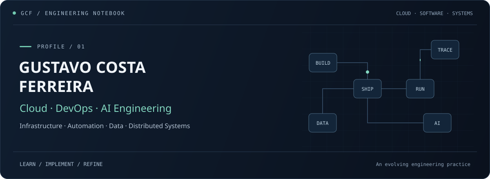

<div align="center">



<br>

### Cloud Engineering · DevOps · AI · Automation

**Designing scalable systems, automating infrastructure and exploring AI-driven engineering.**

<br>

[](https://www.linkedin.com/in/gustavo-costa-ferreira-b3124b325/)
&nbsp;&nbsp;
[](mailto:gustavocostaferreiracontato@gmail.com)

</div>

---

## `> engineering_profile`

I'm **Gustavo Costa Ferreira**, an Information Technology undergraduate at **Univesp** working at the **Instituto do Legislativo Paulista (Alesp)**.

My engineering interests are centered around **Cloud Computing, DevOps, Infrastructure Automation, Data Engineering and Artificial Intelligence**, with an emphasis on building scalable, maintainable and interoperable systems.

My work also involves digital public-sector platforms where **accessibility, security, privacy and interoperability** are essential requirements.

---

## `> technology_stack`

### ☁️ Cloud & Platform Engineering

<p>
  
</p>

`Cloud Architecture` · `Containers` · `Infrastructure as Code` · `CI/CD` · `Automation`

### ⚙️ Software Engineering

<p>
  
</p>

`Backend Engineering` · `APIs` · `Automation` · `Distributed Systems`

### 🤖 AI & Data

<p>
  
</p>

`AI Engineering` · `Data Pipelines` · `LLM Integration` · `Data Automation`

---

## `> current_focus`

```yaml
engineering:
  cloud:
    - architecture
    - infrastructure_as_code
    - containerization

  devops:
    - ci_cd
    - automation
    - observability

  ai:
    - llm_integration
    - intelligent_automation
    - data_engineering

  principles:
    - scalability
    - security
    - interoperability
    - accessibility
```

---

## `> engineering_principles`

**Cloud-Native Architecture**  
Design systems around scalability, resilience and automation.

**Infrastructure as Code**  
Treat infrastructure as versioned, reproducible software.

**Automation First**  
Reduce repetitive operational work through code and pipelines.

**Security & Privacy by Design**  
Build systems with security and LGPD requirements considered from architecture onward.

**AI as Engineering Infrastructure**  
Use AI where it improves workflows, automation, analysis or software capabilities — not simply as a feature.

---

## `> github_activity`

<p align="center">
  <picture>
    <source media="(prefers-color-scheme: dark)" srcset="./assets/profile-stats-dark.svg">
    <source media="(prefers-color-scheme: light)" srcset="./assets/profile-stats-light.svg">
    
  </picture>
</p>

---

## `> system_status`

```text
[ CLOUD ]        ███████████████████░   Building
[ DEVOPS ]       ███████████████████░   Automating
[ AI ]           ██████████████████░░   Exploring
[ ENGINEERING ]  ████████████████████   Learning continuously
```

---

<div align="center">

### `> connect --with gustavo`

**Cloud · DevOps · AI · Software Engineering**

[](https://www.linkedin.com/in/gustavo-costa-ferreira-b3124b325/)
&nbsp;&nbsp;
[](mailto:gustavocostaferreiracontato@gmail.com)

</div>
